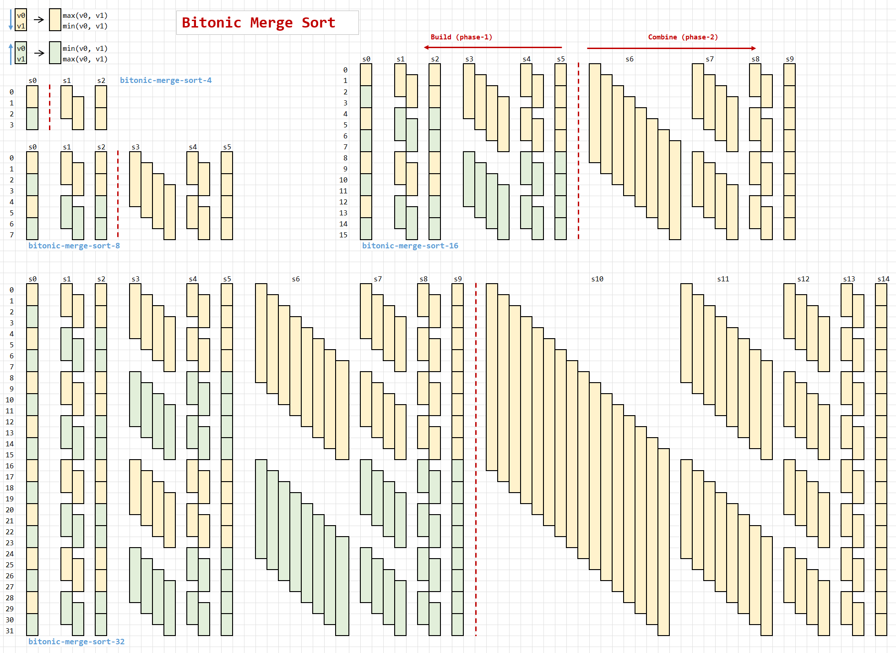

## bitonic merge sort
this example implement warp level bitonic merge sort. The `med3` instruction, combined with `DPP`/`SHFL` makes it ultra fast and instruction saving to implement sorting on AMD GPU.



## build/run
```
sh rebuild.sh # build
./build/warp_sort.exe
```
will have output like:
```
[WARP SORT BITONIC]____________________________________________
[origin-2]2.986 3.929
[sorted-2]3.929 2.986
--------------------------------------------------------------- ordered[>][y]
[origin-4]2.857 8.086 3.743 6.629
[sorted-4]8.086 6.629 3.743 2.857
--------------------------------------------------------------- ordered[>][y]
[origin-8]8.571 1.943 1.114 2.157 1.971 7.057 2.586 4.486
[sorted-8]8.571 7.057 4.486 2.586 2.157 1.971 1.943 1.114
--------------------------------------------------------------- ordered[>][y]
[origin-16]6.271 8.200 5.786 1.657 3.086 7.714 7.500 6.057 3.971 5.957 0.743 7.114 8.314 5.557 6.857 4.657
[sorted-16]8.314 8.200 7.714 7.500 7.114 6.857 6.271 6.057 5.957 5.786 5.557 4.657 3.971 3.086 1.657 0.743
--------------------------------------------------------------- ordered[>][y]
[origin-32]8.271 5.500 5.229 2.557 1.471 5.414 5.629 1.457 3.800 6.729 3.600 2.214 1.657 2.629 6.700 4.371 ...
[sorted-32]8.471 8.271 8.057 7.843 7.029 7.000 6.729 6.714 6.700 6.029 5.629 5.500 5.414 5.229 5.029 4.943 ...
--------------------------------------------------------------- ordered[>][y]
[origin-64]3.686 8.371 5.714 5.143 1.657 2.757 6.586 5.457 5.943 6.643 7.657 7.586 0.686 2.229 3.386 7.957 ...
[sorted-64]8.529 8.371 7.957 7.657 7.586 7.257 7.229 7.071 7.043 6.957 6.929 6.643 6.586 6.529 6.457 6.443 ...
--------------------------------------------------------------- ordered[>][y]
[origin-2]4.614 1.800
[sorted-2]1.800 4.614
--------------------------------------------------------------- ordered[<][y]
[origin-4]6.400 5.943 5.071 3.757
[sorted-4]3.757 5.071 5.943 6.400
--------------------------------------------------------------- ordered[<][y]
[origin-8]4.614 6.400 1.686 2.300 1.314 5.371 4.843 0.643
[sorted-8]0.643 1.314 1.686 2.300 4.614 4.843 5.371 6.400
--------------------------------------------------------------- ordered[<][y]
[origin-16]4.529 8.200 1.129 5.729 1.643 8.543 6.800 8.157 5.729 1.114 5.557 8.271 7.557 5.543 7.229 0.543
[sorted-16]0.543 1.114 1.129 1.643 4.529 5.543 5.557 5.729 5.729 6.800 7.229 7.557 8.157 8.200 8.271 8.543
--------------------------------------------------------------- ordered[<][y]
[origin-32]7.900 8.286 7.357 2.186 5.643 3.843 2.386 1.686 6.686 4.057 0.429 4.443 5.871 5.271 5.086 1.829 ...
[sorted-32]0.429 1.014 1.343 1.686 1.829 2.186 2.214 2.329 2.386 2.629 2.657 2.986 3.000 3.843 4.000 4.057 ...
--------------------------------------------------------------- ordered[<][y]
[origin-64]7.871 3.086 0.957 4.943 3.371 3.329 3.071 6.500 7.386 8.514 2.371 4.671 1.657 7.443 2.943 3.000 ...
[sorted-64]0.014 0.357 0.586 0.671 0.700 0.886 0.886 0.957 0.971 1.014 1.071 1.100 1.100 1.300 1.343 1.386 ...
--------------------------------------------------------------- ordered[<][y]

```

this example rely on [ck](https://github.com/ROCm/composable_kernel/), please modify `CK_DIR` inside `rebuild.sh` before build
